## JS概览

### 尽量不要将js内嵌到html中，这样会污染html，且效率低下。例子：

```javascript
function createParagraph{
   	const para = document.createElement('p');
    para.textContent="don't do this!";
    document.body.appendChild(para);
}

<button onclick="createParagraph()"><button/>
```

js语句直接写进了html中，会使得代码混乱，且如果我们要给剩下的button设置事件不得不全部通过onclik赋值，这很麻烦

更好的做法：

```javascript
<script>
    const buttons = document.querySelectorAll('button');
	for(let i =0;i<buttons.length;i++)
    {
    	buttons[i].addeventlistener('click',createParagraph);
    }
</script>
```

### js的调用策略

（由于html是按照流的方式顺序去加载，如果js脚本出现在其操控的元素之前，代码将会出错）

```javascript
//1 内部
document.addEventListener("DOMContentLoaded",function(){
    //dosth
})

//2 外部
<script src="xxx.js" async></script>
```

~~通过上述的两种方式来保证逻辑的正确性~~，DOMContentLoaded指html文档树加载完成后会触发的事件 即后面的function；

async指明遇到script标签时不要中断html的加载，脚本会和html一同加载 (async只对外部js文件有效)

(个人还是比较疑惑，async只是保证了不阻塞html后续内容的加载，似乎也无法保证脚本一定会在加载完后才执行，为什么就一定不会出错呢？)

DOMContentLoaded和以前将所有脚本都放在body最末端有着同样的缺点：必须等待所有html元素加载完毕后这些脚本才可以得到执行，可能会导致延迟较高的缺陷。

defer能保证不同脚本的顺序执行，并且看到一种说法defer虽然也是异步加载，但并不是加载完后马上执行，而是在dom树构建完后顺序执行，async则是谁先加载谁执行，这和Mozilla描述的 ：

- 如果脚本无需等待页面解析，且无依赖独立运行，那么应使用 `async`。
- 如果脚本需要等待页面解析，且依赖于其它脚本，调用这些脚本时应使用 `defer`，将关联的脚本按所需顺序置于 HTML 中。

较为一致

所以async并不是解决 “执行顺序” 的方案，原则上在脚本内部还是不要操作dom树，它的出现主要是解决阻塞问题，即加载js会阻塞html的解析，出现加载时间过长的问题 参考链接：https://segmentfault.com/q/1010000022143102 还是比较可信的

### var与let的区别

```javascript
//var的变量提升特性使得只要在一个域内 用var声明变量，即使这个变量在赋值之后，也是有效的
vartype='vartype';
var vartype;
//这种写法用let是不行的，且这种写法只在脚本中有效，在console中也不行

//var 可以重复的定义变量
var duplicate = 1;
var duplicate = 2;
//let 同样不行
//可以的话尽量使用let，它减少了可能产生的语义不明，使得代码能够更加规范
```

### 数据类型

js中全都是对象吗？x 也是有6种基本类型的

js是动态语言，不需要指定类型，会自动推断类型。使用typeof可以看到当前类型

```javascript
let dog = {name:'doggie',type:'big',age:'number'};//定义对象的方式，暂时了解即可
```

要注意js种的数字全部都是Number类型，不分int float等

### ===与==

===表示值和类型都相等，==表示只需要值相等

### 字符串

```javascript
let string = "double quote";
let str = 'single quote';
//string需要用引号包裹，单双都可以，但请保持一致。
let containd='this will "work"';
let contains="this will 'work' too";
//如上所示不同的引号可以包裹，但是相同的不行，它会引起歧义
let fatalcontain='this won't work';
//该语句会报错 使用转移字符解决该问题
let contain = 'i\'m a good man';
```

字符串拼接使用+,数字在拼接时自动转成字符串；

```javascript
let mynum = 20;
let mystr = mynum.toString();
mystr++;
mynum=Number(mystr);
//数字与字符串的互转
```

字符串相关api：

```javascript
let stringapi='stringapi';
stringapi.length;
stringapi[0];
stringapi[stringapi.length-1];
stringapi.indexOf('api');//字符串匹配，将返回匹配的首字母位置，没有匹配的则返回-1;
stringapi.slice(0,3);//提取字符串，str 第一个参数表示起始位置，第二个参数为结束位置的后一个位置（不包含该位置)
//第二个参数可以不用，表示从0开始剩余的所有字符
stringapi.toLowerCase();
stringapi.toUpperCase();//大小写转换
stringapi=stringapi.replace('api','stringgg!');//注意可以不等长，且replace并不会真的改变原有string对象的值，需要重新赋值。猜测string在js中也是不可变对象，所以操作string返回的都是新对象。
//replace只会替换第一个找到的字符，replaceall会替换所有的
```

### 数组

```javascript
let arrstr=['ss','ss','gg'];
let random = ['ss',0,[9,10,20]];//js的数组可以混合类型
random[2][2];//20 数组包含数组的情况
arrstr.length;//3 长度
```

数组api：

```javascript
//数组与字符串的转换
let myData = 'Manchester,London,Liverpool,Birmingham,Leeds,Carlisle';
let myarr = myData.split(',');//通过,分割成数组
myData = myarr.join(',');//通过，与join函数将数组拼接成一个新的字符串
myData=myarr.toString();//虽然也是数组转为字符串，但是分隔符不可控
let newLength=myarr.push('scotland');//push向数组尾部加入新元素，并返回新数组的长度
let removedItem=myarr.pop();//pop删除数组尾部元素，并返回该删除的元素
//unshift对应push，shift对应pop 只不过它们针对的是数组的首部
```

### 条件语句

**任何不是null NaN undefined 0 false ”“的值都返回true，这一点要特别小心**

其余的点和Java几乎完全一致

### 函数

JS中函数和方法有着不同的含义，方法代表着定义在 结构对象内的函数（面向对象的封装）

或许这和语言种类有关，java这种面向对象的语言，所有方法都是定义在类中，哪怕是静态方法也是属于class对象的方法，可能这就是为什么java中不会有这种区分。

```javascript
//匿名函数 不定义函数名，常常与事件处理程序一起使用
myButton.onClick=function(){
    alert('click')!
}
//同理可以将匿名函数赋给变量
let myFunction= function(){
}
//之后我们可以通过这种方式调用
myFunction();
//但是不推荐这种调用方式，它看起来很费解
//这种方式也称为 函数表达式，与声明函数有一些区别。声明函数会进行声明提升，即放在后面的声明我们在前面也能用到;而函数表达式不会进行提升（let肯定不提升,不清楚var会不会)
```

**JS的函数传参不是必须的，如果某种情况不需要参数直接调用并不会”编译“不通过，不过你需要在运行时对这种情况做出相应的特殊处理，比如判空操作**

函数内部的作用域是隔离的，域里面的变量等不会被外部访问；函数的最外层是全局作用域，它里面的变量可以在任意地方访问。

所以在全局作用域中定义变量是要小心的，因为我们常会引入多个js文件，这难免会造成冲突。

**需要注意函数声明后当你使用 f()时，只要带了括号就是函数调用，此处就代表函数返回值；如果你想给一个变量赋值函数就不可以带括号，带了括号意义就变了**

```javascript
function f()
{
    //do-sth
}
let arg = f; //这是函数赋值
let value=f();//这是函数调用，由于f返回void 则value也是void

```

```javascript
for(let num of nums)
{
	num;        
}
//不带index的for循环使用 of 关键字		
```

函数篇最需要注意的一点：由于JS没有编译阶段，函数在定义时无论是参数还是返回值 都是不确定的，可能为空，可能为其他类型，或者根本不存在，即使是多参数的函数也可以不传参，所以一定要多考虑这些默认情况下的处理，使用isNaN等函数做好特殊情况处理

11，事件介绍

btn:onfocus 获取焦点 onblur 失去焦点 ondblclick 双击 onmouseover 鼠标移入 onmouseout鼠标移出

window: onkeypress 按下按钮（整个过程) onkeydown(按下) onkeyup(抬起) 注意设置button的这几个事件不会起作用，要设置给代表整个浏览器的window

**尽量避免在html中内嵌事件处理器的赋值**

```html
<button onclick="inner()"></button>
<script>
function inner()
{
        
}
</script>
这种写法会使整个html结构混乱，难以管理
```

**新引入的addEventListener和removeEventListener有着更强大的功能**

```javascript
const btn = document.querySelector('button');
btn.addEventListener('click',listener);
function listener(){
    
}
function listenertwo()
{
    
}
//相较于传统的
btn.onclick=listener
//这种写法可以通过remove方法移除事件,且当调用
btn.addEventListener('click',listenertwo);
//并不会移除原有的listener函数 而如果用
btn.onclick=listener1
//就会进行覆盖，是没法实现这种效果的
```

**事件对象**

在给某个事件注册一个监听后，当在触发该事件时，js中其实有一个隐式的传参

```javascript
btn.onclick=handleEvent;
function handleEvent(e){
    e.target.style.background='red';
}
//当handleEvent因为事件触发被调用时，实际上调用了handleEvent(event)，这里传入的event就是这个事件对象
//该对象包含一系列有用的属性，可以供我们在函数体中使用
//目前最需要关注的就是e.target 该target即直接触发该事件的元素，这一点务必搞清楚，即使是冒泡传递事件，target也永远是最初的那个元素

```

**阻止默认行为**

有的事件自带一些默认行为，例如表单的提交，当你点击表单中的submit时，如果你没有设置validate判断条件的话，表单里的内容就会被直接提交，而大多数时候我们都想在函数体中进行一些输入的合法判断，所以要阻止次类事件的默认行为

```javascript

form.onsubmit=function(e){
    if(非法){
        e.preventdefault();//阻止默认行为，注意仍然是e来调用，所以event非常有用
    }
}
//提交行为隶属于表单，而不是其中具体某个input
```

**事件捕获与冒泡**

我最初理解的是捕获和冒泡是两种不兼容的事件机制，只是不同的浏览器采取了不同的方法；这种理解是错误的，虽然我还不是100%确定，但是事件的捕获和冒泡应该是一个完整的事件机制中的两部分，捕获负责从上到下的遍历寻找目标元素，冒泡负责从下往上的真实触发，因为android中的onDispatchEvent和onTouchEvent就是如此，如果没有捕获，怎么知道触发的目标元素是哪个呢？（具体的寻找算法就别纠结了，简单的理解为坐标判断是否在矩形内，在里面继续遍历，不在里面就停止）

所以这两者是同时存在的一种事件机制的两个阶段，这就很好解释 事件监听注册 发生在不同阶段时 事件的传递顺序也会有不同这一现象。不管是冒泡还是捕获，事件默认都是由穿透性的，所以一条父子链上的元素在到达tail之前都会触发注册过的监听事件，也就是为什么需要用stopPropgation来停止这种穿透的行为。

不过我们也可以利用这一特性，将子元素的处理事件代理给父元素，达成一种统一处理的情况。

注：addEventListener可以将事件注册的阶段更改到捕获阶段 第三个参数为true代表捕获阶段注册事件并触发

```js
btn.addEventListener('click',testDispatch,true);
function testDispatch()
{
}
```


### 对象基础

**关于使用字符串访问数组下标，原理是数组本身是一个对象，此时相当于给该对象加了一个成员变量，而并不是往数组中加了个元素；所以我们定义一个对象后，也可以用[field]的方式去访问成员，都是一个道理**

```js
let fakearr={
    'name':'jack',
    'age':24
}
fakearr['name']// 正确

let arr={
    name:'jack',
    age:24
}
arr.name //正确
//这两种方式在结果上似乎是一致的，至少我在chrome中试验过，两种访问方式都能在两个对象中访问到name对应的值
```

这种直接创建出的对象被称作 字面量

js中的对象成员是动态的，即使你没有提前定义你也可以通过.或者[]的方法去访问并赋值

[]的访问方法有一个优势，因为我们可以将字符串传入[]内去访问，字符串本身是动态的，就达到了动态访问成员的目的

### 对象与原型


由于以前接触的都是面向对象（以类和对象为结构）或者是面向过程的语言，对于原型这个概念相当陌生，加上mozilla的翻译和语言组织在这一章相当混乱，把我饶了好久，最后总结出以下一些原则。

**暂时不考虑Class创建对象的情况，这里只阐述原型对象**

1，每个对象都有一个 原型对象(\_\_proto\_\_属性)，这是在对象创建时就默认的，它和我们自定义的其他属性没有区别，就是一个正常的字段，我们知道属性的类型可能是 基本类型(不太确定js是否有基本类型) 或者 对象，而该proto属性也是一个对象；

2，由上面的原则，我们可以推断出proto自身 也有自己的 proto对象；

3，函数本身也是一个对象，那么函数也有自己的proto对象(nativecode)；

4，但是函数有一个特殊的属性叫做prototype，这个东西我称之为原型模板，一定不要把它和proto混淆，且这是函数对象（也就是 f 对象）才自带的对象，我们正常创建的对象是没有这个属性的

5，原型模板相当于 定义了一个proto，使得通过该函数为构造器创建对象时，对象的proto等于该原型模板

6，由5得知，通过函数new对象时，默认的proto就是函数的prototype。也可以通过obj2=Object.create(obj1) 以obj1为原型对象创建一个新对象

7，由6得知，默认情况下，create中的参数为空，那么就以Object的prototype为原型对象创建对象，这也解释了为什么默认情况下我们都能使用Object的原型模板中的方法

8，原型链访问只能聚集在该链上，也就是说原型对象外的方法或属性我们是访问不到的

9，对于一个独特的构器造函数而言，原型模板是唯一的一个对象，所有由它“创建”的对象中的proto都指向这一个原型模板对象，相当于一种 组合 的形式来构建新对象。所以如果我们扩展原型模板，不推荐添加新的属性值，因为所有对象共享这一份属性，makes no sense。对应的，扩展方法会是一个好的选择，因为可以通过this始终访问对象自身的属性，并在方法内做相应的运算得到想要的结果

10，prototype属性会有一个constructor属性，指该原型模板隶属于哪个构造器函数。我们可以通过原型链，用obj.constructor来访问到该构造器函数本身。


**原型对象也只不过是一个普通的对象，且构造器函数也是一个对象，prototype只是构造器函数的一个属性，这也就代表对于一个构造器而言，真实存在的对象只有一个，那么该类型构造器的原型模板对象也只有一个，任何由该构造器创建的对象的 原型对象 都指向同一个原型模板**


自己画的图，能涵盖上方的知识点：



_tips_:

1,在函数体（构造器）内定义属性，在原型上扩展方法

```js
function Person(name,age,....)
{
    let this.name = name;
    let this.age = age;
    //定义对象属性
}

//在原型模板上去扩展方法
Person.prototype.getName=function(){
    return this.name;//依然可以通过this访问到该 Person对象，且不同对象的name属性各不相同
};
Person.prototype.getAge=function(){};


//假设我们定义了
Person.prototype.fullname;
//由于prototype只是一个普通的对象，它怎么样都无法映射出所有的Person对象的全名，所以用函数来解决这种问题
```

2，通过create创造对象

```js
let person2 = Object.create(person1);
person2.__proto__;//__proto__=person1
//但是此时person2就不能说是 Person 类型的对象了，因为它并不是由Person构造器创建的
//且person2自己也没有name等属性，它只能通过链式访问到person1的name等属性
```

3，巧用constructor

```js
let person1 = new Person('sam','kack',24);
person1.constructor;//输出f: Person(name,age....)
//constructor是原型模板的一个属性，所以由构造器创建的对象都可以通过链式访问到它
person1.constructor.name;//Person
let person2 = new person1.constructor('jack','jones',22);//使用这种方法来new对象，假如我们不知道构造器函数是什么，这种方式就很好的解决了问题
```

### 原型与类

ES6引入了class 

```javascript
class Parent{
    
    constructor(name){
        this.name=name;
    }
    
    static sayHello()
    {
        
    }
    sayname(){
        
    }
}
class Child extends Parent{
    constructor(name,age){
        super(name);
        this.age=age;
    }
    sayage()
    {
        
    }
}
let p=new Parent("jack");
let c=new Child("rose",19);
```

从以上的继承中我们可以得到以下的行为:

Parent.sayHello() --可执行

Child.sayHello()  --可执行

p.name; --值为jack

c.name; --值为rose  这说明Child的实例单独拥有name属性

p.sayname();  --可以执行

c.sayname();  --可以执行

c.sayage();   --可以执行


ES5中是如何实现类似class的行为？

```javascript
//难点1：属性如何继承
//不难看出在class中其实不不在constructor外申明变量同样可以为对象申明属性，我想真正起作用的其实还是constructor内部的
//this.attr=value,也就是这类语句真实的为对象申明了属性。super其实就相当于调用了一遍父类的constructor，所以子类对象也等同于声明了父类中的属性。我想es5中的call 或 apply 函数是类似的机制，本质上等于将此段语句在“子类”函数体中执行了一遍
Parent.call(this,attr1,attr2...);
//难点2：静态方法如何继承
//Parent和Child本身为函数对象
Parent.sayHello = function(){};//就使得Parent本身有了sayHello的方法 想要Child通过原型链访问，只能使得
Child.__proto__=Parent；//也就是在 函数对象 这一层面上，Child能使用Parent所有的属性与方法
//难点3：非静态方法如何继承
Parent.prototype.sayname=function(){};//使得Parent的对象p能够使用sayname()方法 而Child的对象c是从Child.prototype
//中寻找，很显然没有这个方法，那么就要到Child.prototype.__proto__中找，这里不要被搞晕了，原型链的寻找永远都是以__proto__为指向，只不过Child的对象c的__proto__就是Child的prototype，也就是
c.__proto__.__proto__ === Child.prototype.__proto__; //true 所以我们通过
Child.prototype.__proto__=Parent.prototype;//此赋值操作就使得原型链能访问到sayname
// Child.prototype=Object.create(Parent.prototype); 这么写也可以

Child.prototype.constructor=Child;//一定不要忘了给constructor赋值，prototype一定会有一个constructor，表明构造器函数是哪个函数对象

Child.prototype.sayage=function(){};//最后通过此方法给Child的对象定义方法，即完成

```

比较晦涩的几点：（纯理论上要如何去理解）

1，为什么Child Parent的prototype不是由Function的prototype创造的，而是由Object的prototype创造的（prototype到底意味着什么，又是谁发起的建造）

答：prototype本身也是一个对象，那么它的proto一定也是某个构造器函数的prototype; 以Parent为例，它的proto是Function.prototype，这很好理解，即对象由谁创造，那么对象的proto就是构造器的prototype。那么要回答这个问题，本质就是prototype这个对象是谁创造的，此时会有些疑惑，还是拿Parent为例，既然它由Function创造，那Parent.prototype必然就不是Function创造，在没有继承的情况下，一个函数的prototype默认就是由Object构造的，即只是一个普通的对象，没有别的特征，也就是Parent.prototype.__proto__=Object.prototype。且从逻辑上来理解的话，一个函数构造器的prototype代表着它创造出来的对象有什么特征，所以没有继承时，我们定义的函数构造器创造出的对象默认只能是Object，相当于一种“继承”

Parent.prototype.__proto__=Object.prototype： Parent创造出的对象有Object的特征，我们通过拓展Parent.prototype使得它有自己的特征。Child.prototype.__proto__=Parent.prototype：Child创造出的对象有Parent的特征，也就复合了继承的特征。

2，Child的proto为什么是Parent

答：因为要使得Child这个函数对象通过proto找到Parent中的函数。

3，属性是怎么继承的

答：如果我们想使得建造出的对象有自己独立的属性，通过原型是无法实现的，因为所有proto指向的prototype都是同一个，往里面加属性也是无济于事，大家还是会共享“父属性”，结论就是属性不适合用原型链来进行扩展。

需要借用构造函数并调用call，使得父构造器的语句在子构造器函数体中执行，等于给子构造器也申明对应的属性。

参考链接：

https://www.freecodecamp.org/chinese/news/inheritance-in-js/

https://segmentfault.com/a/1190000015780543

### 模板字符串

```javascript
let str = 'jack';
`this is ${str}`;
//使用 `` 与 ${}来实现变量嵌入字符串
let lines=`break
line`;
//模板中的换行符会被还原，而不需使用\n

let outer = 'outer';
let inner_true = 'inner true';
let inner_false = 'inner flase'
//模板字符串的嵌套 可以在${}中继续使用`${}`，一般用在条件选择的情况比较多

//这种写法是错的 因为$中相当于就是一个表达式，outer作为一个变量,outer'aa'的写法当然是错误，应该写成outer+''
`out---${outer`---in---${isTrue()?inner_true:inner_false}`}`
//将${}理解为 将其中的语句执行完后返回的结果再插入字符串中
//这种写法就正确了，因为${}内部的语句是语法正确的，有正确的返回值
`outer${isout()?outer:`inner:${isin()?inner_true:inner_false}`}`

//带标签的模板字符串

let dog = 'black';
let size = 20;
tmptag`this ${dog} is a ${size}!!`

function temptag(strings,dogExp,sizeExp)
{
    strings.raw[0];//代表原始字符串 下标表示是哪一部分，原始字符串包含\n等
 	let str0 = strings[0]; //'this'
 	let str1 = strings[1]; //' is a '
 	let str2 = strings[2]; //'!!'  
    //模板字符串会根据$标签将其中的固定字符串分割到strings数组中
    
    //dogExp相当于dog传进来的参数，sizeExp同理
    let dogResult=dogExp+' dog';
    let sizeResult=sizeExp>15?'big dog':'small dog';
    return `${str0}${dogResult}${str1}${sizeResult}${str2}`
    //this black dog is a big dog!!
}

```


### JSON

```javascript
//json的形式与js中申明对象的形式完全一致，不过只能使用双引号，且属性名也必须用双引号包裹，不可省略
let arrjson=[{"name":"jack","age":20},
             {"name":"jack","age":20},
             {"name":"jack","age":20}]
let request = new XMLHttpRequest();//使用xhr创建http请求
request.responseType='json';//设置返回类型为json
request.onload=function(jsonObj){
    //在设置返回处理函数时jsonObj就根据responseType转换成了json对象，我们可以直接使用此对象访问它的属性
    let name = jsonObj[0]['name'];
}
//数组也是合法的json
JSON.parse(text);//将字符串转换为json对象
JSON.stringfy(jsonObj);//将json对象转换为字符串
```


加餐：箭头函数，lambda表达式，函数式编程

### 箭头函数

```javascript
(parameters)=>{statement};
(parameters)=>{return expression};
//箭头函数不带this,它的this是从上一个作用域中继承而来
(parameters)=>({name:'jack'})//直接返回一个 对象字面量 其实就是小括号中构造了一个对象

//暂时了解到这里 
//https://developer.mozilla.org/zh-CN/docs/Web/JavaScript/Reference/Functions/Arrow_functions
//什么是参数列表解构？
```


### JS异步发展过程

历史上，回调是JS异步的主要实现方式，即某个结果返回了，再根据此返回结果链式的调用下一个

```javascript
//
function doStep1(input,callback)
{
	callback(input+1);    
}

function doStep2(input,callback)
{
  callback(input+2);  
}

function operation()
{
    let input = 1;
    doStep1(input,result1=>{
        doStep2(result1,result2=>{
            console.log(result2)
        })});
}
//这种写法很容易造成回调地狱，难以理解，所以现代JS都使用Promise来实现异步
//思考：为什么会有回调地狱这种写法？
//1，必须抽象出callback，因为我们不确定回调之后具体业务要做什么，对于 异步 操作而言，回调业务和它是无关的，所以必须有一个回调函数的存在，而不是写死业务
//2，尽管将每一层的callback单独定义成函数看起来是可行的，一定程度上能减少金字塔缩进，但也带来了新的问题：一方面这样的可读性也有所下降，因为要一个个callback跳转着去读，并不能连续阅读整段逻辑；另一方面这样也可能实现不了对应的需求，因为scope的原因，这样的函数可能无法访问到上一层调用中的变量，虽然这种情况没有那么多且可以通过参数定义一定程度上解决，终究也是比较麻烦的
```

### Promise

```javascript
const fetchPromise = fetch('https://mdn.github.io/learning-area/javascript/apis/fetching-data/can-store/products.json');
//fetch()函数会立即返回一个Promise对象而不管耗时操作是否已经完成
//Promise有3种状态:
//pending:初始状态，操作还在进行中，既没有兑现，也没有拒绝
//fulfilled:兑现状态，操作成功完成，then()函数将被调用
//rejected:拒绝状态，操作失败，cache()函数将被调用
//这里的成功与失败不是指结果的成功失败，比如http请求返回404，这也是一个结果，所以仍然是fulfilled;如果网络发生错误没有得到结果等则此时为rejected 关于promise的状态下面有一小节单独讲解

//为promise设定操作完成时的“回调”
fetchPromise.then(response=>{
    console.log(response.status);
});

//由于then返回的对象仍然是Promise对象，使得我们可以链式的去进行调用，而不用嵌套了
fetchPromise.then(response=>{
    return response.json();// 需要注意这里是要有返回的 本例中json()也是异步的，是个非常好的演示例子
}).then(json=>{
    console.log(json[0].name);
});
//then是Promise的一个函数，它的参数是一个callback函数，该callback函数在可以执行时，传入的实参是返回该Promise对象的 then函数中的 callback的 返回值.....这么解释起来真的很拗口，简单来说就是上一个then中函数的返回值，非常符合链式调用的规范

//将catch放在链式的最后，那么所有链中的error都会流到这里，统一处理
.catch(error=>{
    console.log(error);
})

//使用.all会集中处理一组promise，注意接收的参数也变成了responses数组，且任意promise的请求操作失败都会导致直接进入catch语句块，不太清楚是不是所有请求操作成功后才进入then中的callback，既然使用了for循环我想应该是的
Promise.all([promise1,promise2,promise3]).then(responses=>{
    for(const response of responses)
        {
            console.log(response.status)
        }
}).catch(error=>{
    console.log(error);
})

//尽管.any也是集中处理一组promise，但是它只会兑现一次成功的请求，这里response又变成了单个的变量，且所有promise请求都失败才会流入catch语句块
Promise.any([promise1,promise2,promise3]).then(response=>{
  	console.log(response.status)      
}).catch(error=>{
    console.log(error);
})


//使用async申明异步函数，在函数体中使用await申明等待点，即等待后续的异步操作完成返回结果后再继续
//其实就是同步的写法，只是我们借助了async和await使得它被调用时不会阻塞主线程
async function aFetch()
{
    try{
	const response = await fetch('url');//使用await后fetch不会再立即返回一个promise对象，而是执行耗时操作返回response
    if(!response.ok)
        throw new Error(`HTTP 请求错误：${response.status}`);
    const json =await response.json();
    console.log(json[0].name);
    }catch(error){
    	console.log(error);   
    }//此时的异常捕获需要我们手动编写
}

aFetch();//由于申明了函数为异步，它并不会阻塞主线程

//async函数返回的对象一定是promise对象，不管你的return语句写了什么
```

**这几部分对我来说相当难懂，想要搞清楚它的原理需要花费大量的功夫，只能暂缓**

#### Promise术语

何为resolve，Promise C是怎样才会依赖于Promise B

https://thenewtoys.dev/blog/2021/02/08/lets-talk-about-how-to-talk-about-promises/

异步大杂烩：

https://www.one-tab.com/page/5m9HT8jOQF-bqz8mcYzmEg

Promise并不是实现了异步机制，它是解决了回调地狱！


### 返回值

then方法返回一个[`Promise`](https://developer.mozilla.org/zh-CN/docs/Web/JavaScript/Reference/Global_Objects/Promise)，而它的行为与then中的回调函数的返回值有关：


- 如果then中的回调函数返回一个值，那么then返回的Promise将会成为接受状态，并且将返回的值作为接受状态的回调函数的参数值。


- 如果then中的回调函数抛出一个错误，那么then返回的Promise将会成为拒绝状态，并且将抛出的错误作为拒绝状态的回调函数的参数值。


- 如果then中的回调函数返回一个已经是接受状态的Promise，那么then返回的Promise也会成为接受状态，并且将那个Promise的接受状态的回调函数的参数值作为该被返回的Promise的接受状态回调函数的参数值。


- 如果then中的回调函数返回一个已经是拒绝状态的Promise，那么then返回的Promise也会成为拒绝状态，并且将那个Promise的拒绝状态的回调函数的参数值作为该被返回的Promise的拒绝状态回调函数的参数值。


- 如果then中的回调函数返回一个未定状态（pending）的Promise，那么then返回Promise的状态也是未定的，并且它的终态与那个Promise的终态相同；同时，它变为终态时调用的回调函数参数与那个Promise变为终态时的回调函数的参数是相同的。
