## Vue入口流程

最外层的index.html(vite阶段开始将index放在public之外)是实际的入口;

index中会执行src/main.js;

main.js会创建app,并将创建的app挂载到index中的对应id上;

挂载后显示的内容就是创建的app(可从文件中指定创建)

采用构建流程（使用vite或者vue-cli）挂载会替换根节点，使用引入js的方式不会，直接通过{{}}表达式使用app中的data

## 模板语法

{{msg}}：标签内容里的绑定形式

如果msg的值中包含<>，这种方法会将其还原成纯文本。

如果想通过msg定义html标签，需要使用v-html，并将标签显示声明，通过v-html赋值属性。


## 响应式基础

**无论是组合式还是响应式，因为都是通过代理对象来实现的响应式，所以更改属性时务必使用代理对象而不是原对象，因为原对象不是响应式的，尽管更改它的属性会表现在代理对象上，但是不会刷新DOM**

### 选项式响应

Vue3中的数据通过JS中的Proxy代理来实现响应式，下面这个例子可以很好的解释这一现象

```vue
export default{
data(){
return{
	objectA:{}
}
}

mounted(){
let objectB={};
this.objectA=objectB;
if(this.objectA===objectB)
//false
}

}

```

在对objectA赋值时，objectA成为了objectB的一个代理，应该是new Proxy(objectB,handler)，所以它们不相等。好处是objectA始终是响应式，objectB不会成为响应式。

尽管是Vue是响应式更新，但是DOM的更新不会在数据跟新后立刻就刷新。数据更新会被暂时缓冲，在下一次‘flush’时统一更新。使用nextTick()可以确保访问的DOM元素是在真实更新后的。

Vue3是深层响应的，即对一个{object:{nested:{data:1}}}而言，当通过object.nested.data进行改变时，也能检测到是object的变化从而响应此改动。也可以通过 let shallow=shallowReactive(first:1,nested:{data:1})创建浅响应数据，即只有直接属性改变会被检测到：shallow.first会被检测到，shallow.nested.data改动则不会。

**有状态**的方法参见APP.VUE中的例子。主要注意需要对不同组件实例分别创建单独的函数对象，不能让它们共享。

**特别注意，即使是在选项式中，对象类型的属性也仍是一个proxy，这一点通过console可以验证，可能就是用的reactive方法创建的proxy；而基础类型的属性虽然console打印出来是原始值，但不清楚具体是如何实现的。可能的方案：1，reactive不支持原始类型，所以使用reactive对象包裹，但reactive似乎不支持解包，所以可能不行；2，使用ref(0)创建，利用自动拆包的特性。如果是ref我就可以通过value去访问它的rawvalue，且需要导入ref方法，但是通过value访问到的是undefine，且我们不需要导入ref也能申明原始类型属性，所以应该就是this的一个真实属性，至于它为何是响应式的就不太清楚了**

### 组合式响应

~~vue中将不同的组件整合到一个大的组件上是另一种开发模式，但是暴露出的组件在编写时和选项式有一些差异。~~

组合式需要用到 setup钩子函数，并在其中将属性return出去来暴露。

通过<script setup>语法糖来简化编写过程。

最开始使用reactive方法创建响应式对象，但是原始类型无法使用该方法，上面已经说过。

**重要**：

在组合式中，无论是ref还是reactive，由于此时响应式的对象是初始赋值时的对象，当我们尝试使用author = ref({})替换整个对象时，该操作不会生效，且相当于切断了原有的响应链，后续即使改变author的属性也不能响应，因为此时author指向的对象不是响应式的！

这里还有一些例子，需要仔细理解

```javascript
const state = reactive({ count: 0 })

// n 是一个局部变量，同 state.count
// 失去响应性连接
let n = state.count
// 不影响原始的 state
n++

// count 也和 state.count 失去了响应性连接
let { count } = state
// 不会影响原始的 state
count++

// 该函数接收一个普通数字，并且
// 将无法跟踪 state.count 的变化
callSomeFunction(state.count)

```

为了解决一部分上述的问题，ref出现了

1，基础类型可以使用ref，会返回一个带有value属性的ref对象，且该value值为基础类型的值；如果是对象类型则会自动通过reactive返回一个proxy并赋给value

2，尽管此时替换整个ref仍然会切断响应链，但此时我们不必这么做，因为想替换原对象的话只需要改变value的值，那么ref对象本身的地址没变，它的响应链仍然存在，value发生变化也就能成功响应

3，由于ref在使用时是一种引用，也就打破了基础类型传值的限制，当我们通过函数传递一个ref(1)的实参时，传递的实际是ref的地址，在函数体内访问的仍然是原有的ref，那么响应链就没有被切断

```javascript
const objectRef = ref({ count: 0 })

// 这是响应式的替换
objectRef.value = { count: 1 }

const obj = {
  foo: ref(1),
  bar: ref(2)
}

// 该函数接收一个 ref
// 需要通过 .value 取值
// 但它会保持响应性
callSomeFunction(obj.foo)

// 仍然是响应式的
const { foo, bar } = obj
```

**ref在模板中的解包原则**

最顶层的ref会被自动解包，否则不会

```js
const top = ref(1)//会自动解包
const inner = {inner:ref(1)}//inner.inner+1不会解包运行为1+1

const {innertotop} =inner//等于将innertotop提升到最顶层，那么innertotop就等于最顶层的一个ref
```

但是有一个特例，如果没有使用表达式，inner.inner会被解包，因为它代表了最终值。

**ref在响应式对象中的解包**

1，只有嵌套在深层响应式对象中的ref才会被解包；

2，当外层响应式对象是一个数组或map时，当通过下标或key访问ref时不会被解包


## 计算属性

计算属性会缓存计算结果，在第一次计算后，只有当函数体内的 响应式数据 发生改变才会再次调用方法重新计算结果。而调用函数则会每次都重新调用，在面对较为耗时的操作时，计算属性在性能表现上会优于函数。但是计算属性不如函数灵活，函数可以传参，是一个真正的方法，而计算属性其实更像一个 响应式的数据，只不过这个数据要经过一些原始数据的计算。

计算属性本质是一个 ref ，理论上在访问时要通过ref.value来访问真实值，但是在模板中会自动解包，所以可以直接使用。事实上我们定义的 响应式属性都是 ref，但是在使用中似乎不需要ref.value;回想起昨天在获取dom节点时使用console.log时必须要用value才能打印出真实的dom节点。

注意最好不要在computed中的函数直接更改响应式对象的属性值，而是通过副本返回。且最好不要产生副作用，如异步请求或是dom树的改变。setter”修改计算属性“要通过修改原属性值来达成，因为计算属性本身是一个副本，要将它当作一个只读的快照副本，修改它并不符合这个规范。

## 类与样式的绑定

class与style大体有两种绑定方式，使用{}时内部可以访问css本身的classname或者属性名称，可以通过响应式的bool类型数据控制该class/style是否写入样式；style可以直接使用属性来定义样式。

使用[]时需要借助ref定义对应的class/style，可以通过三元表达式来控制样式是否写入，同时也可以使用{}的方式（更推荐）

使用computed来计算逻辑更为复杂的样式并返回使用

自动前缀：对于那些在特定浏览器中需要前缀的属性，vue会为这些属性自动添加前缀以便浏览器能支持对应的属性

style中支持属性（前缀）多值，实际取值会取数组中浏览器所支持的最后一个值

```vue
<div :style="{display:['-webkit-box','-ms-flexbox','flex']}"></div>
```

需要注意：样式的绑定有点琐碎，写法种类比较多，要熟练掌握{}的写法，将其视为json对象的定义方式，项与项之间用，隔开；

组件上的样式行为:

```vue
<MyComponent :class="{active:isActive}">

</MyComponent>
<!--假设p为MyComponent的根元素,当isActive为true时active会传递给p;如果有多个根元素需要指定哪个元素来接收组件的class样式-->
<p :class="$attrs.class">
</p>
<div>
</div>
<!--其实是组件的属性透传，多个根元素都可以接收-->
```


## v-if与v-show

注意事项：

v-if可以加在整个template上用来表示整个模板是否存在；

v-else必须搭配v-if一起使用；v-else不能单独使用，也不能和v-show放在一起；

v-else-if的使用和编程语言中的else if基本类似，接在v-if后即可；

v-if在切换时有较大的开销，因为它是真实的创建与销毁一个元素。v-show只是单纯的改变display的属性；

建议需要频繁切换的话使用v-show，如果变动很少可以使用v-if，v-if的初始开销相对较小。

**v-if不推荐和v-for放在一起使用，这样会使两者的优先级不明显 参考文档：**

**https://cn.vuejs.org/style-guide/rules-essential.html#use-component-scoped-styling**

## v-for与列表

### v-for与v-if的正确混合用法

v-if的优先级要比v-for高，所以先执行，那么下面这个例子中就会抛出error。

```vue
<ul>
    <li	v-for="user in users"
        v-if="user.isActive">
        {{user.name}}
    </li>
</ul>
<!--因为在执行if时user这个变量还不存在，所以会抛出错误。需要通过计算属性来修正，即先filter出符合条件的集合，再全部渲染-->


<script>
	const users=ref([{name:'harry',isActive:true},{name:'ronn',isActive:false}]);
	const activeUsers=computed(()=>{
        return users.filter(user=>user.isActive)
    })
</script>

<template>
    <ul>
		<li v-for="user in activeUsers">
            {{user.value.name}}
		</li>    
	</ul>
</template>

<!--or-->


<template>
	<ul>
        <template v-for="user in users">
            <li v-if="user.isActive">
                {{user.name}}
    		</li>
		</template>
    </ul>
</template>
```

v-for包裹的块中，可以完整的访问父作用域中的属性与变量。第二个参数index代表数组的下标

v-for同样可以进行嵌套，始终理解v-for块中可以访问所有父作用域的属性与变量。

**v-for同样可以遍历普通对象的属性，遍历顺序由Object.keys()返回值决定；for (value,key,index) 的三个参数分别代表值，属性名，属性下标**

v-for并不是必须用在ul中的，它代表有v-for的标签需要‘循环’创造n次，这刚好符合列表ul的特性，所以我们常常搭配一起使用。事实上任何标签都可以单独加上v-for并循环创建多个实例。

in可以搭配整数使用，但是此时i的起始值是1而不是0。	

**key的使用**：

当v-for的数据内项的顺序发生改变，默认行为下dom树的顺序不会发生改变，而是采取一种“就地更新”的策略来提高性能。但是对于**列表渲染结果依赖于 组件状态或者临时dom状态**的情况，这种策略无法满足我们的需要。所以要引入key来唯一标识一个dom节点，以便进行重排序或者重用。

key是vue的虚拟dom上的一个属性，应该使用基础类型如number或string，不要使用对象。

key必须是唯一的，不可以重复；key的顺序发生变化，dom树的顺序就会发生变化；key被删除时对应的dom节点也会被删除

key还有一个巧妙的用法，用于强制替换一个元素/组件（因为key变化时dom节点就是新的，如果只有一个节点那就是全新节点）

```vue
const text=ref('content')
<span :key="text">{{text}}</span>
```

有些情况下这很有用：

1，强制触发组件生命周期hook函数，因为是新创建的所以会重新走一遍生命周期；

2，触发transition

**数组替换**：

需要注意filter，concat等部分方法不会改变原始数组，会返回一个全新的数组，如果要使用这些新数据源要手动替换该结果。

此时就符合数组顺序改变的情况，默认策略的高效性就体现了出来，如果丢弃原有dom再全部重新渲染，消耗就太大了。

**如果需要使用计算属性或函数来将源数据过滤/处理成目标结果，始终注意不要在这些方法内使用sort，reverse方法改变原数组顺序与内容，请使用副本**

**组件上的v-for**:

使用无特殊差异，但是不会自动向组件中注入 项，需要手动向组件传递prop

```vue
<MyComponent v-for="(item,index) in items"
             :name="item.name"
             :key="item.id"
             @remove="items.splice(index,1)">
</MyComponent>


<!--MyComponent的定义-->
<script setup>
    defineProps(['name'])
    defineEmits(['remove'])
</script>
<template>
	<li>
        {{name}}
        <button @click="$emit('remove')">
    	</button>
    </li>
</template>
```

我们可以在组件中’定义‘属性，这样组件在被使用时传递属性就与外界数据源解耦了，否则自动注入item组件直接依赖外部数据，根本就没法复用。注意函数的定义用的是emit，绑定使用$emit;属性的定义用的是prop

## 事件处理

**内联事件处理器**:

```vue
<button @click="count++; count*=2;Math.abs(count)">内联事件处理</button>
<p>{{count}}</p>
```

内联处理器中也可以写多个语句，但是这里相当于多句表达式，所以很多全局对象访问不到，例如console.log就无法执行，而Math，Date则可以访问到。


**方法处理器**:

定义函数时，可将event作为参数传入，并在函数体中利用event访问对应的dom对象

```js
function greet(event){
    alert(`hello ${greeting.value}`)
    if(event)
    console.log(event.target)
}
```


内联处理器中支持调用函数，所以传参在这里就显得非常方便

```vue
<script>
	function saysth(msg)
	{
	}
    //注意event始终放在最后一个参数
	function warn(msg,event)
    {
        console.log(event.target.tagName)
    }
    
</script>

<template>
	<button @click="saysth('hello')"></button>
	<button @click="warn('warning',$event)"></button>
    <button @click="(event)=>{warn('warning',event)}"></button>
   	<!--通过$event或者箭头函数在内联处理器中传递dom中的原生事件-->
</template>
    
```

### 事件修饰符

stop:停止冒泡；prevent:阻止默认行为；self:只有事件是自身触发时才处理；

可以只有修饰符，而不设置方法，这样就只将事件的限制加了上去

```vue
<form action="http://baidu.com" method="get" @submit.prevent>
            <input type="submit" value="提交"/> 
</form>
<!--此时点击提交什么也不会发生，因为默认行为被阻止了-->
```

修饰符可以链式调用，但是它们的顺序对结果是有影响的：

@click.prevent.self: 阻止所有点击事件的默认行为，包括子元素冒泡上来的

@click.self.prevent:只阻止自身的点击事件的默认行为，子元素冒泡上来的则不会阻止

addEventListener对应的事件：

capture：在捕获阶段触发事件，而非冒泡阶段;

once：事件最多只触发一次;

passive：事件的默认行为立即执行

注意passive是 申明使用默认行为，与prevent是其实是互斥的，所以不要放在一起使用

**按键修饰符**：

```vue
<input @keyup.enter="submit">
<!--当按下回车抬起时触发事件
vue的按键别名：
.enter
.tab
.delete (捕获“Delete”和“Backspace”两个按键)
.esc
.space
.up
.down
.left
.right
-->

<!--系统按键修饰符:shift ctrl alt 此类事件需要获取焦点才能触发-->
<input @keyup.alt.enter="trigger"> 
<!--按下alt+回车才会触发-->
<button @click.ctrl="foo">
    按住ctrl再点击才会触发foo
</button>
<!--exact表示完全符合条件才会触发，上述情况是一个超集，只要按下了规定的键，即使按了别的键也仍会触发-->

<button @click.ctrl.exact="exactfoo">
    仅当按住ctrl再点击才会触发exactfoo
</button>

<button @click.right="rightfoo">
    点击鼠标右键触发事件;left right middle
</button>
```

## 表单输入绑定

1，v-model绑定时，输入控件的默认值会忽视其本身value属性，所以务必使用响应式api去进行默认值的初始化；

2，text，textarea绑定value并侦听input事件；radio，checkbox绑定checked property并侦听change事件；select绑定value并侦听change事件

**checkbox使用：**

1，单个checkbox，不设置value，使用bool类型的v-model绑定，代表其是否被选择；

2，多个checkbox，每一个都需要有value，使用数组类型的v-model，选中的box会将value推入数组中

***tips：原生html中checkbox与radio是通过name属性被划分到一组的，vue中不需要设置name，使用v-model进行分组***

radio需要设置value，使用字符串类型的v-model，选中的radio会将绑定的model值设为其value

radio不能像checkbox一样使用单个来代表是否被选中，行为比较诡异，值变成了on

select单选时，假如初始状态无默认选中值，在ios上会导致第一项无法选择，所以用一个disable的option来占位第一项解决该问题

option被选中时，如果option的value没有赋值，其内容就会被当作value赋给对应的v-model；

多选时要使用multiple属性，选中的option会将值推入对应的v-model数组

**为了能将选中的value类型拓展为bool 字符串以外的类型，要将v-model与:value配合使用，通过设置:value的响应式变量来使得选中时的value为对应的对象**

true-value与false-value虽然可以配合单个checkbox来设置是否选中时的value，但这两个attr本身无法影响checkbox的value，如果默认初始值未设置，此时的value依然是空而并不是false-value的值，所以并不推荐这种使用方式。更推荐使用radio单选来完成类似的功能。

**修饰符**:

.lazy:将同步更新放在change事件而不是input事件；.number将输入自动转换为数字(number类型而不是字符串)，当无法转换时则使用原始值 例如11aaa的字符串会始终parse为11这个number；.trim自动去除输入中的前后空格

## 生命周期

生命周期API:https://cn.vuejs.org/api/composition-api-lifecycle.html#onbeforeupdate


现阶段对Vue的生命周期只能有一个概览，一方面不知道每个阶段具体做了什么（涉及到vue的原理，机制），一方面没有实际的落地用处，所以不太能深刻理解钩子函数的作用。但是能总结一些较为简单的准则

1，mount之前的阶段create似乎不太需要关注，api中并没有暴露该阶段的钩子函数；

2，onmounted代表在组件渲染并创建dom节点后的时机，调用该钩子函数时，相当于将一个callback注册进了组件实例，所以我们必须同步调用而不可以使用settimeout，否则会出现  组件挂载完成但是由于没有注册callback所以mounted阶段也无法触发钩子函数 的情况

3，任意dom的更新都会触发onUpdated，尽量避免在其中做更新dom的操作，这样可能陷入无限更新的bug中；某些情况下可能需要使用nextTick才能正确访问更新后的dom（有点不理解）

4，其余常用钩子为onMounted以及各阶段的before函数

5，onErrorCaptured会在捕获了后代组件的错误时调用，默认情况下会一直向上传递到app.config.errorHandler;当在其中返回false时表示该错误已被处理，不再继续向上传递；在函数中可以根据错误情况将组件状态设置为一个预先定义的“错误状态”，但要注意不能因为此更新造成新的错误，否则又将陷入无限捕获错误的bug；如果在函数中抛出一个错误，将被发送到errorHandler。

## watch监听

```vue
<script>
    const objNum=ref({count:0})
    watch(objNum.value.count,(val)=>{
    console.log(`obj${objNum.value.count}`)
})//非法watch，因为A watch source can only be a getter/effect function, a ref, a reactive object, or an array of these types
</script>

```

1，当watch简单类型的ref时，发生改变oldvalue与newvalue分别代表旧值与新值，由于是基础数据类型，所以很容易对值进行副本存储，才能分别访问到前后不同的值；

2，当类型为对象类型时，watch的应该是该reactive对象而不是ref；且直接传入reactive对象时，是深层次的监听，意味着对象的任意属性改变都会触发watch函数，如果是一个属性较多的大对象这对性能有不少的损耗，所以需要慎用；

***tips:所以使用ref({})时应该watch ref.value，因为value代表着reactive对象实体，且由于对象属性改变，但是对象本身不变，所以oldvalue与newvalue其实是同一对象，其中的属性自然也就完全相同；假如此时watch ref本身，那么只有在完全替换value时才会触发对应的监听函数；并且当替换value后，之前watch该reactive value的链就断掉了，之后更新value属性将不会触发其监听函数***

3，更推荐通过getter函数来返回对象的某一个属性值，仅监听该属性而不是整个对象

由上述tip所知，当getter函数返回一个对象时，仅当该对象被替换时才会触发此监听函数；可以通过申明为{deep true}改为深层监听。

watch默认是懒加载，只在数据源发生改变时触发；{immediate:true}可以在最初阶段直接执行一次监听函数

**watchEffect**：

简化了我们在使用异步调用时的编写方式，可以省去immediate，且会在回调中自动追踪同步代码（第一个await之前）中的响应式对象或属性，不用再一个个去watch。

总结：watch更加精确的监控对应的属性，且监控的时机也由我们掌控，但是对于多个属性如果想避免深层监控可能需要编写较多的watch体；watcheffect使用起来较为方便，会在回调中自动追踪访问的响应式对象属性，但是监控时机不太可控，且默认会直接调用一次。

**回调时机:**

默认的watch回调时机是在dom树更新之前，想要访问dom树更新之后的状态需要传入{flush:'post'}对象；

watchPostEffect有着完全相同的功能

一般来说我们不需要显式的去停止一个监听，如果需要的话手动调用watch或watchEffect返回的函数即可

```vue
<script>
const unwatch=watchEffect(()=>{})
unwatch()//即可停止watch
</script>
```

在创建watch时务必使用同步方法创建，异步的方式会造成内存泄漏，且不会监听成功；

如果需要等待一些异步数据，你可以使用条件式的侦听逻辑：

```js
// 需要异步请求得到的数据
const data = ref(null)

watchEffect(() => {
  if (data.value) {
    // 数据加载后执行某些操作...
  }
})
```

## 模板引用

vue中的元素可以使用ref这个特殊属性，当定义一个和属性值同名的ref变量时，vue挂载后会将该元素在dom中的实例赋给ref的value，以便我们能够直接的操作dom树。

***一定要注意只有在挂载完成后ref的value才与对应的dom节点绑定，在这之前value始终为null***

```vue
<script>
    const divref=ref(null)
    const divif=ref(true)
	//在使用watch/watcheffect时需要注意null的边界情况
    watchEffect(()=>{
        if(divref.value){
            
        }else{
            //value为null时我们也要catch到，因为watcheffect是会直接调用一次，这发生在mount之前，此时的value必然是null；
            //且通过v-if将元素卸载后也会触发函数，且值也为null
        }
    })
</script>

<template>
	<div ref="divref" v-if="divif">
    </div>
</template>
```

在将v-for与模板引用一起使用时，需要注意两点：

1，refs申明为一个数组，其value是一个数组对象的代理，如果想遍历该数组使用iterator不可行，需要通过下标与length去遍历；

2，refs数组内的dom顺序和数据源list的顺序不一定相同（应该是和v-for的就地更新策略有关，如果设置了key属性是否会保持一致？）

***函数模板的描述是组件更新会触发该函数，这里的组件更新并不是指响应式数据变更引起的组件更新。函数模板 :ref 更像是一种动态绑定的方式，通过el将dom节点赋值给ref或者对象属性***

**在子组件上使用模板引用**：

```vue
<!--childComponent 定义-->
<script setup>
    defineProps(['name'])
    defineEmits(['remove'])
    const a =10
    const bref=ref('b')
    
    defineExpose({
        a,b
    })
</script>
<template>
	<li>
        {{name}}
        <button @click="$emit('remove')">
    	</button>
    </li>
</template>

<!--使用childComponent-->
<script setup>
	const childRef = ref(null)
</script>
<template>
	<childComponent ref="childRef">
    </childComponent>
</template>

```

如果子组件是使用的选项式api或者没有使用<script setup>，此时的childRef就和子组件本身的this一样，我们可以通过childRef访问子组件的所有属性和方法，虽然这看起来很简便，但是仍然不推荐这么做，会使得父子组件高度耦合，应该始终通过define的prop和emit来进行父子组件之间的数据交互。

当子组件使用了<script setup>，这表示组件内容为私有，父组件就无法再直接访问其中的属性。需要通过defineExpose将需要的属性暴露出去，此时childRef就={a:value,b:value} 该过程仍会自动解包

## 组件基础

**组件的定义**:

1，在使用构建步骤时，一般用单个vue文件定义组件（sfc），在使用时需要import；

2，不使用构建步骤也可以在一个js中定义组件，并通过export导出；其中的模板使用template属性+字符串定义，字符串可以是完整的html标签或者是引用的页面内标签id；如果是默认导出就是该文件名的组件，也可以使用 具名导出 在一个文件内导出多个组件

**组件的使用**:

每个组件实例内的变量都是相互独立的；

不确定：默认情况下函数是共享的（或许是定义在了原型中），因为debounce函数那里说过带状态的函数，组件之间默认共享会造成混乱，所以在每次created时都调用debounce创建一个单独的防抖函数实例。

当直接在原生html中想要使用组件标签时，必须使用kebab-case的写法，且需要显示的去关闭标签。同时对于元素位置有限制的标签，需要先使用原生的标签，并将其is属性设置为"vue:mycomponent"才可以正确使用。

**定义属性与事件**:

```vue
语法糖：
<script setup>const props = defineProps(['attr'])
//defineProps是<script setup>中可用的编译宏命令，不需要显式的导入；其入参数组中可以定义多个属性；
//该命令会返回一个包含所有属性的props对象
console.log(props.attr)

//1,需要在子组件中定义一个事件
const emit = defineEmits(['btn-enlarge'])//emit就和模板中的$emit一致，是一个返回的函数；此处无法访问$emit，所以如果要抛出事件需要用这种方法 emit('btn-enlarge')

//2,需要在子组件中抛出该事件
<button @click="$emits('btn-enlarge')"/> 
//3,在外层接收事件并处理
<chilidcomponent @btn-enlarge="size++"/>
</script>

不用语法糖:
<script>
export default{
    props:['attr']
    emits:['btn-enlarge']
    setup(props,ctx){
        ctx.emit('btn-enlarge')
    }
}

</script>


```

***要注意在使用：attr传值时是一种响应式绑定，=后面的不再是实际值而是一个响应式对象，如果只是正常的赋值切记不要带上：否则不会将=后的内容解析成具体的值***

可以通过<slot/>插槽来占位，向子组件中传递content内容

```vue
<script>
const Tabs={
    Tab1,
    Tab2
}
const currentTab=ref('Tab1')
</script>

<template>

<component :is="Tabs[currentTab]"></component>
</template>
```

通过component标签和is属性来配置可插拔的组件，默认行为下未选中的组件会被直接卸载，通过keepalive可以将其保活。

需要注意的一点，这里不能将 导入的组件本身（Tab1,Tab2） 申明为一个响应式对象，会对性能有很大的影响；正确的方式是通过响应式的下标去进行访问，当对象在定义时没有设置属性名时，默认属性名就是该变量名；可以通过Tabs[currentTab]访问到对应的组件，非常的巧妙。

## Props注意事项

### prop的单向数据流

原则上，prop如果需要发生改变，那么更改它的操作应该是父组件发起的，而不是子组件本身。因为子组件对属性的更改会影响父组件的状态，使得状态管理会变得混乱，且这样会增加父子组件的耦合性。如果确实需要更改，更合理的做法是由子组件通过emit抛出一个事件，在父组件中接收后并作出相应的更改。

如果子组件只是要对某个属性进行本地化保存或是根据一些规则展示，则通过变量拷贝+计算属性就可以实现这些功能，而不需要直接对prop进行更改。

当传递一个对象/数组为prop时，尽管修改该prop对象的属性时不会抛出子组件修改prop的warning，但我们仍然需要避免这样做，理由和上述理由一致，且在vue中通过对象引用来更改属性值会对性能产生较大的损耗（不太理解为什么）

### prop类型检查

```vue
<script setup>
    defineProps({
    //prop类型检查，只有对象定义的方式可以使用该特性
    propA:[String,Number],//值可以为String或Number
    propB:{
        type:Number,
        required:false,//该值为true时表示必须传递该prop，默认都是可选的
        default:25//默认值为25
    },
    propC:{
        type:Object,
        default(rawProps){
            return{
                'attr':'attrValue'
            }
        }//当为Object时必须通过一个工厂返回默认构造值
    },
    propD:{
        type:Function,
        //该函数作为默认值
        default(){
            return 'default function'
        }
    },
    propE:{
        //自定义值检查器，赋值必须是这些值中的一个
        //也可以自定义规则，该函数输入一个value，返回一个bool值表示value是否合法
        validator(value){
            return ['messy','haland'].includes(value)
        }
    },
	person:{
        type:Person,
        default(rawProps){
            return new Person('jessie','pinkman')
        }
    },
    //boolean有特殊的使用方式，属性显式声明在标签中时不用赋值，默认为true，未声明时为false
    disabled:{
        type:Boolean
    }
})
//需要注意defineprops内部是无法访问到script中定义的其他变量的，因为其在编译时会移到整个函数的外部
</script>
```


## vue ref和element plus节点

1，ref的用法是没问题的，无论是语法糖setup还是export default方式都是ok的。vue2使用$refs的方式，vue3中也能兼容；vue3更推荐使用const elid=ref(null)的方式，不过要注意如果是export的方式得在setup中return这些refs

2，ref（浅薄来说）提供了一种更便捷的访问元素/节点的方式，不用每次都去查询

3，对于懒加载的元素，需要在确定它加载出来之后才可以访问到它。比如在onMounted方法中使用nextTick访问，或者在opened方法触发后再去访问

4，element-plus的节点并不是我理解中的 html元素，这是今天纠结了4个小时左右才明白的。在ref于其绑定完成后返回的是一个Proxy的Object，其真实对象是element根据不同控件自己定义的 “控件对象”，其中保存着一组构成它的真实元素的属性和方法。尽管通过它的ref/$refs属性可以链式的访问到真实的html元素，但还是有点麻烦的。在使用时或许就不应该这样用，应该通过第一层暴露出的api和属性来控制该控件。

5，querySelector和getElementById是可以用的，今天我犯错把#写成了.才没有查到正确的值！更推荐后者，兼容性更好。


## 练习总结

### 第一次demo

1,跨域请求 客户端与服务端的解决方案分别是什么

https://developer.mozilla.org/zh-CN/docs/Web/HTTP/CORS#%E5%8A%9F%E8%83%BD%E6%A6%82%E8%BF%B0

https://segmentfault.com/a/1190000011145364

https://vue3js.cn/interview/vue/cors.html#%E4%BA%8C%E3%80%81%E5%A6%82%E4%BD%95%E8%A7%A3%E5%86%B3

为什么不能跨域呢？这个限制的意义是什么


2，el-dialog会lock-scroll，导致页面左右抖动，禁用之后虽然没有了该行为，但是仍然可以上下滑动，不知道还有没有更好的方案

3，computed 计算属性好像不能像函数一样调用，需要再实验一下

4，js声明一个对象不能只用let arg;需要let arg={},否则后续无法通过arg.attr新增属性并赋值;

5，在vue的函数中访问data或者method必须使用this. 否则访问的域不对，对应的值会是undefined

6，vue2中对象，列表内部数据变更不会同步到视图，要用this.$set方法触发。vue3不再需要这样做，直接更新属性就会响应到视图

7，当使用this.$option.methods.fuction()调用方法时，此时内部的this不再是vue，会出现一些问题，后续看下这个调用链是什么意思，以及vue中的this到底是在什么scope下起作用

8，http请求还有delete和put方法，delete很像get的请求方式（拼接字符串），put很像post的请求方式（放在body中）

9，this.$forceupdate可以强制vue组件刷新，但是不推荐使用

10，promise中reject是通过不断的throw error向下传递的，因为才catch中会去handlereject，就调用到了回调中的onReject；需要再看一遍reject的完整流程 

https://zh.javascript.info/promise-error-handling

https://blog.towavephone.com/async-exception-throw-evolution/

11，什么是js的proxy object

todo：大列表的解决方案1，分页 2，上拉加载更多-->虚拟滚动

https://vue3js.cn/interview/JavaScript/pull_up_loading_pull_down_refresh.html#%E4%BA%8C%E3%80%81%E5%AE%9E%E7%8E%B0%E5%8E%9F%E7%90%86

### 滚动条的控制



从图中可以了解滚动条到底处于什么位置。滚动条始终会和其右边界对齐，且此时content的padding计算位置发生变化，不再是border的右边界，而是滚动条的左边界；所以当通过增加padding来使得container变宽时，滚动条会随着border而不断的右移

但要注意container的宽高此时需要设置为100vw和100vh(多少都行，但是必须固定)。

对于宽度：默认情况会使得border和视窗对齐，此时滚动条可见，我们通过设置padding只会将内容向左侧顶而不会使得border变宽！（个人认为此时的box-sizing是border-size，所以border始终和右边界对齐）当我们手动设置宽度时默认的box-sizing是content-size，就可以通过增加padding使得border右移。

对于高度：此时overflow属性非常重要，且需要和高度进行配合。假设对于一个container我们不设置高度，默认最终高度是所有子元素高度之和，此时就不存在滚动可言，只有当子元素超出container时才有滚动这个概念，此时overflow才能起到作用。要注意html中，子container的“高度”是可以超过父container的，如果父container设置了hidden，由于此时子container高度等于它的子元素高度之和，所以依然无法滚动。

### 滚动事件的坑

1，区分onscroll事件和wheel事件，onscroll只有在元素真正的产生滚动时才会触发，而wheel事件是监听的鼠标滚轮事件

2，onscroll事件在冒泡阶段不会冒泡，捕获到之后只有触发的元素本身能感知到该事件；尽管document.defaultview触发scroll时scroll会冒泡穿透，但因为defaultview本身已经是最外层元素，所以没什么意义

3，当html和body的高度超过viewport的高度时，自动使用系统的滚动，该滚动事件会冒泡。但是我不认为 最外层会滚动和穿透 有关

#### 事件的产生和传递

事件的捕获会从父元素一直到目标元素，这个目标元素实在是令人感到困惑，因为似乎在捕获链开始时这个元素（target)就已经确定了,将target赋值给event后开始向下传递，直到到达target元素后开始冒泡。所以scroll事件的来源才是滚动穿透这个行为最让人困惑的点。

首先只有能滚动的元素才能产生scroll事件，但这不代表子元素不可以scroll就不能在container中产生scroll事件。因为scroll事件是属于UI事件的，而不属于鼠标事件！也就是它是“二次”产生的！我猜测它的产生是根据一系列的wheel事件以及当前dom树中父子元素是否可以滚动的状态来决定的。当wheel事件向上冒泡时，假如当前元素可滚动，就发出一个该元素的scroll事件，如果wheel事件向上传递到父元素且计算父元素也可以滚动，由于子元素已经发出了scroll事件，此时相当于被“锁定”了，所以父元素不会再发出scroll事件。这属于个人的理解，在元素定位正常的情况下是make sense的。

但是当我们设置了子元素fixed后就会出现不一样的地方。尽管此时wheel事件还是会从子元素传递上去，但是父元素不会再根据wheel事件计算自身是否能scroll，也就是此时正常文档流中的父元素都不会产生scroll事件；只有一种特例那就是window/document.defaultview如果是可以滚动的情况，它就会发出最开始说的最顶层的可穿透的scroll事件，被自己消费。

由于实在找不到scroll事件产生的具体机制，我只能按照这种思路去理解和记忆。黔驴技穷（也令我惊讶为何google也查不到类似的问题）

这是chromium的官方事件模型文档，留个坑吧，也不知道什么时候能涉及到这些知识，似乎将浏览器原理的人非常少，也没有找到太多的技术资源。https://chromium.googlesource.com/chromium/src/+/HEAD/docs/ui/input_event/index.md

currentTarget（只读对象）：只有在事件调用时可以访问到，在console中直接打印event看到该属性是null。该值始终表示实际绑定该事件的元素

Target：表示触发事件的元素

### 跨域方案

原因：为了安全，浏览器限制脚本内的跨 源(origin) http请求。即只能从 加载该资源（脚本）本身的源去请求资源。举个例子：客户端A（浏览器）访问https://domain.com加载了对应的html+css+js，当js文件下载完成后，js脚本通过xhr或者fetch向https://domainx.com发起请求加载图片，由于前后的域发生了变化，该请求就被视为跨域请求，默认情况下就会失败。

源由 地址+端口+协议来唯一标识，任何一个不同都会视为不同源。

方案一：

#### 跨域资源共享（CORS）

通过在HTTP头中加入一组新的标头字段，**通过服务器申明哪些源有权限访问哪些资源**。但是对于 非简单请求 还需要进行一次通过OPTION发起的 预检请求（preflight request)来判断服务器是否允许此次CORS，这几个概念是CORS中的核心机制。

**简单请求**:

1，简单请求不会触发cors预检机制，即该请求就是原请求且response中包含了需要的资源；

2，满足以下所有条件才是一个简单请求：

​	Ⅰ. 使用 get/post/head 方法之一；

​	Ⅱ. 只有一部分标头可以人为的设置 Accept/Accept-Language/Content-Language/Content-Type/Range，其中Content-Type还有更	多的限制。tips：有一部分标头是用户代理自动设置(如Connection，user-agent + forbidden request headers：

​	 https://developer.mozilla.org/zh-CN/docs/Glossary/Forbidden_header_name 即编程人员无法通过代码修改，其实就是 用户代理-	浏览器 帮我们做了	这件事，持有对这些标头的完全控制，保证了安全)

​	Ⅲ. Content-Type指定的媒体类型只能是三者之一 text/plain	multipart/form-data	application/x-www-form-urlencoded

​	Ⅳ. 如果是XHR发出的请求，XHR不能注册upload事件

​	Ⅴ. 请求中不可以有ReadableStream对象

3，此时request 中包含 origin标识请求源，response中包含 Access-Control-Allow-Origin 标识允许的请求源；通过这两个标头即可完成一次简单的跨域请求


**预检请求**:

当一个请求不满足简单请求时，会先发起一次预检请求。该请求通过 OPTIONS方法发起，标头包括 Access-Control-Request-Method标识原request的 请求方式，Access-Control-Request-Headers表示原request中的‘待检查’标头；response中通过Access-Control-Allow-Origin/Methods/Headers来和该请求对应，标识是否允许访问。

当该预检请求成功返回且所有的检查都通过后，才会发起真正的原请求。

tips: 一些浏览器不支持通过OPTION发起的预检请求的重定向，有一些方案

1，将请求改为简单请求，避免预检请求；

2，去掉服务端的重定向

-------->方案退化

1，通过简单请求获取重定向的真实地址

2，使用真实地址再去重新发起请求


**身份凭证**

默认情况下，跨域请求xhr/fetch不会发送身份凭证信息（cookies等）

如果需要的话要在request中将withCredentials设置为true，实际的请求此时会带上cookie；

对应的服务器返回的Access-Control-Allow-Credentials也必须设置为true，否则响应内容会被客户端忽略；

且Access-Control-Allow-Origin/Headers/Methods不可以使用 *，必须明确指明允许的源/头/方法；

预检请求本身不能包含身份凭据，但是它的response需要Access-Control-Allow-Credentials来指明本次跨域请求可以携带身份凭据


文档：https://developer.mozilla.org/zh-CN/docs/Web/HTTP/CORS#%E5%8A%9F%E8%83%BD%E6%A6%82%E8%BF%B0

#### 使用代理Proxy

该方案原理非常简单，以Vue举例，开发环境下在Vue前端服务器上开启一个代理服务器，axios中使用‘/api’标识需要代理的请求，此时在发起请求时会通过代理服务器请求资源，“代理服务器”更像一个中间件，虽然此时它的端口和vue服务器端口不同，但是它本身允许跨域访问，且在response中进行了一些伪装使得客户端无法检测，也就完成了整体的跨域。

```js
amodule.exports = {
    devServer: {
        host: '127.0.0.1',
        port: 8084,
        open: true,// vue项目启动时自动打开浏览器
        proxy: {
            '/api': { // '/api'是代理标识，用于告诉node，url前面是/api的就是使用代理的
                target: "http://xxx.xxx.xx.xx:8080", //目标地址，一般是指后台服务器地址
                changeOrigin: true, //是否跨域
                pathRewrite: { // pathRewrite 的作用是把实际Request Url中的'/api'用""代替
                    '^/api': "" 
                }
            }
        }
    }
}

```

需要注意该方案只在开发环境下起作用，因为生产环境下客户端是从nginx上等静态服务器请求页面资源，除非项目中加入了‘代理中间件’，否则客户端本地不存在代理这个东西，自然就无法使用。

通过配置nginx的代理也可以实现：

```
server {
    listen    80;
    # server_name www.josephxia.com;
    location / {
        root  /var/www/html;
        index  index.html index.htm;
        try_files $uri $uri/ /index.html;
    }
    location /api {
        proxy_pass  http://127.0.0.1:3000;
        proxy_redirect   off;
        proxy_set_header  Host       $host;
        proxy_set_header  X-Real-IP     $remote_addr;
        proxy_set_header  X-Forwarded-For  $proxy_add_x_forwarded_for;
    }
}
```

相当于始终向该nginx请求。
